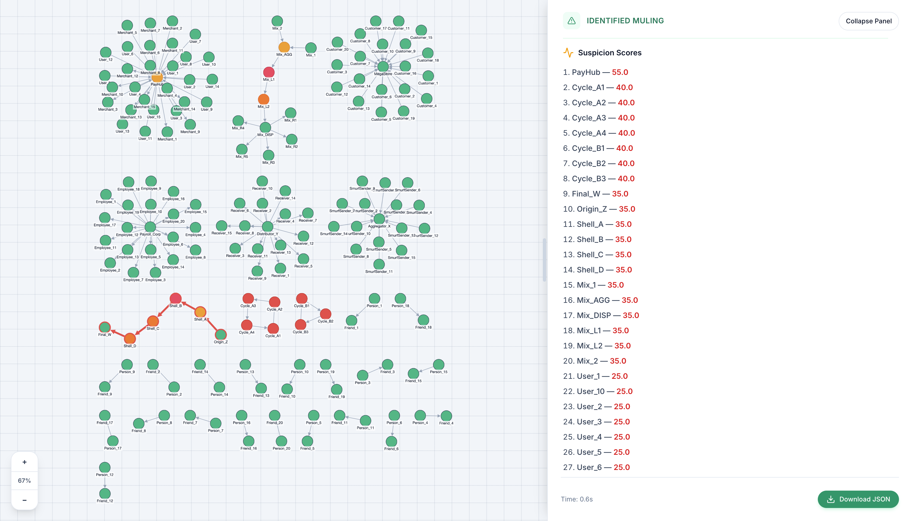
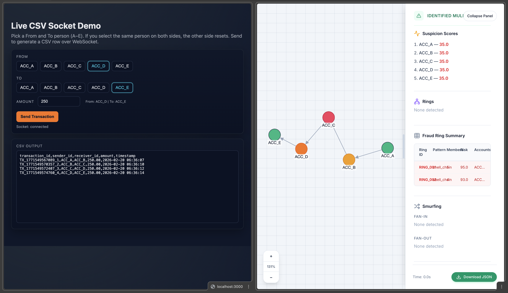
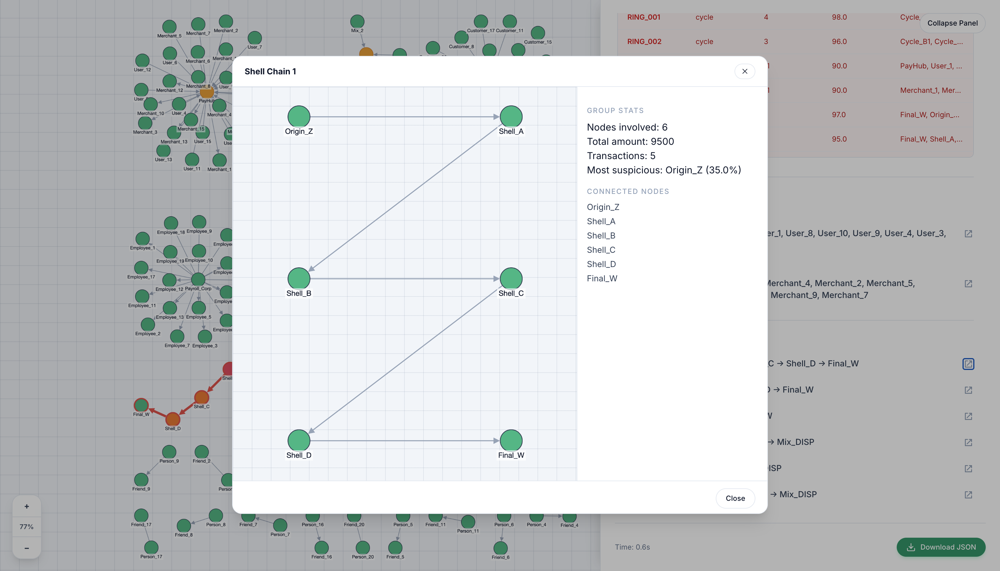
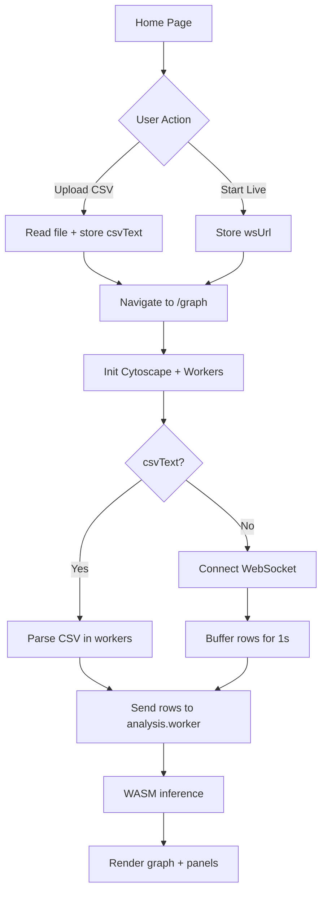

# MuleGuard AI — Graph-Based Financial Crime Detection Engine

Live Demo URL: https://samratsk.github.io/muleguard/

## Screenshots
<table>
  <tr>
    <td colspan="3" align="center">
      
      <br />
      Landing page
    </td>
  </tr>
  <tr>
    <td colspan="3" align="center">
      
      <br />
      General look
    </td>
  </tr>
  <tr>
    <td align="center">
      
      <br />
      Live stream
    </td>
    <td align="center">
      
      <br />
      10k items
    </td>
    <td align="center">
      
      <br />
      Individual chain
    </td>
  </tr>
</table>

## Flowchart


## Project Title
MuleGuard AI — Money Muling Detection Challenge Submission

## Tech Stack
- React + TypeScript
- Vite
- Zustand
- Cytoscape
- **Rust + WebAssembly (WASM)** for high‑performance graph analytics
- Tailwind CSS

## System Architecture
- **UI Layer (React):** CSV upload, live stream input, graph visualization, side panel insights, JSON export.
- **State Layer (Zustand):** Shared analysis state across pages.
- **Compute Layer (Web Workers + Rust/WASM):** Hot‑path detection (cycles, smurfing, shells) compiled to WASM and executed off the main thread.
- **Graph Layer (Cytoscape):** Interactive rendering, selection, zoom, and styling of suspicious nodes and rings.

## Algorithm Approach (with Complexity)
1. **Graph Construction**
   - Nodes: unique `sender_id` and `receiver_id`.
   - Edges: directed transactions with amount and timestamp.
   - Complexity: `O(E)`.

2. **Cycle Detection (rings, length 3–5)**
   - Detect short cycles to identify circular fund routing.
   - Complexity (bounded): `O(V * d^L)` where `L <= 5`, `d` is average degree. Bounded depth keeps this tractable.

3. **Smurfing (Fan‑in / Fan‑out within 72 hours)**
   - Fan‑in: 10+ unique senders → 1 receiver.
   - Fan‑out: 1 sender → 10+ receivers.
   - Uses sliding time window (72h).
   - Complexity: `O(E log E)` for time sorting + window scan.

4. **Layered Shell Chains (3+ hops)**
   - Detect chains of 3+ transfers with low‑activity intermediates.
   - Complexity: bounded DFS depth `O(V * d^L)` with `L` fixed.

## Suspicion Score Methodology
Each account receives a score (0–100) from detected patterns:
- Cycle participation → base score + risk boost
- Fan‑in / Fan‑out → medium risk boost
- Shell chains → high risk boost
- Multiple patterns → additive bonus

Scores are capped at 100 and sorted descending in output. Ring IDs are deterministic and stable for reproducibility.

## Installation & Setup
### Prerequisites
- Node.js (LTS)

### Install
```bash
npm install
```

### Run
```bash
npm run dev
```

## Usage Instructions
### CSV Upload
1. Open the home page.
2. Upload CSV with the exact schema below.
3. Click **Start Security Scan**.

### Live Streaming
1. Enter WebSocket URL on the home page.
2. Click **Start Live**.
3. Each incoming CSV line is batched every 1 second and analyzed.

### Input Specification
CSV columns (exact):
```
transaction_id,sender_id,receiver_id,amount,timestamp
```
- `timestamp` format: `YYYY-MM-DD HH:MM:SS`

### Required JSON Output Format (Exact)
```
{ "suspicious_accounts": [
    { "account_id": "ACC_00123", "suspicion_score": 87.5,
      "detected_patterns": ["cycle_length_3", "high_velocity"],
      "ring_id": "RING_001" } ],
  "fraud_rings": [
    { "ring_id": "RING_001", "member_accounts": ["ACC_00123", ...],
      "pattern_type": "cycle", "risk_score": 95.3 } ],
  "summary": { "total_accounts_analyzed": 500,
    "suspicious_accounts_flagged": 15, "fraud_rings_detected": 4,
    "processing_time_seconds": 2.3 }
}
```

## Known Limitations
- Client‑side analysis is limited by browser CPU and memory.
- Extremely dense graphs may need fast layouts for responsiveness.

## Performance
- ~10k rows process in ~**5 seconds** (parse + inference + render).
- Rust + WASM accelerates graph scans and avoids GC pauses.
- Tight Rust loops operate over typed arrays (`Uint32Array`, `Float64Array`) for minimal conversion overhead.
- WASM runs in a sandboxed module with predictable memory behavior, improving consistency under load.
- Web Workers keep all Rust/WASM compute off the UI thread to preserve interaction responsiveness.

## Team Members
- Saikalyan C B (<a href="https://github.com/saikalyancb-06">@saikalyancb-06</a>)
- Samrat S K (<a href="https://github.com/SamratSK">@SamratSK</a>)

## License
MIT License

Copyright (c) 2026 MuleGuard AI

Permission is hereby granted, free of charge, to any person obtaining a copy
of this software and associated documentation files (the \"Software\"), to deal
in the Software without restriction, including without limitation the rights
to use, copy, modify, merge, publish, distribute, sublicense, and/or sell
copies of the Software, and to permit persons to whom the Software is
furnished to do so, subject to the following conditions:

The above copyright notice and this permission notice shall be included in all
copies or substantial portions of the Software.

THE SOFTWARE IS PROVIDED \"AS IS\", WITHOUT WARRANTY OF ANY KIND, EXPRESS OR
IMPLIED, INCLUDING BUT NOT LIMITED TO THE WARRANTIES OF MERCHANTABILITY,
FITNESS FOR A PARTICULAR PURPOSE AND NONINFRINGEMENT. IN NO EVENT SHALL THE
AUTHORS OR COPYRIGHT HOLDERS BE LIABLE FOR ANY CLAIM, DAMAGES OR OTHER
LIABILITY, WHETHER IN AN ACTION OF CONTRACT, TORT OR OTHERWISE, ARISING FROM,
OUT OF OR IN CONNECTION WITH THE SOFTWARE OR THE USE OR OTHER DEALINGS IN THE
SOFTWARE.
